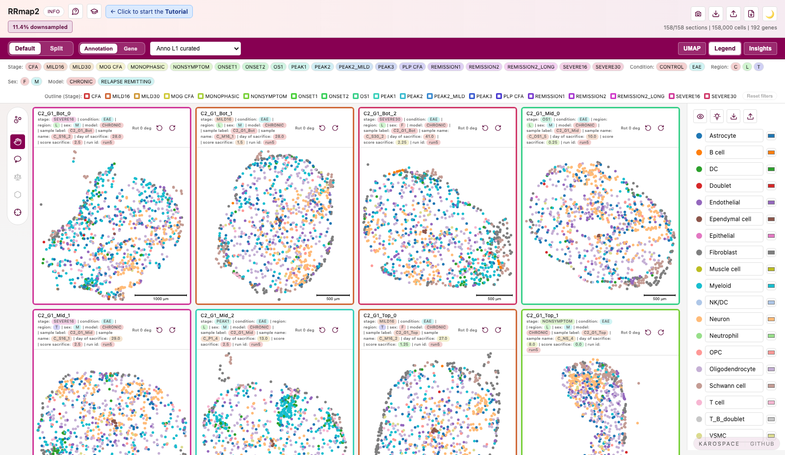

# KaroSpace

**KaroSpace** is an interactive HTML viewer for exploring spatial transcriptomics data. It generates standalone HTML files from AnnData/H5AD or SpatialData inputs that can be shared and viewed in any web browser — no server or Python installation required.

Originally developed at Karolinska Institutet for visualizing Xenium spatial transcriptomics data across multiple tissue sections.

Visit [KaroSpace Website](https://karospace.se/).



> [!NOTE]
> Live Demo ! **Pancreas viewer**: [Open hosted demo](https://christoffermattssonlangseth.github.io/KaroSpace/pancreas.html).

## Features

- [x] **Modal interaction** — Browse many sections in a responsive grid, then zoom and pan any section in detail
- [x] **Section filters** — Filter visible sections by exported metadata such as stage, condition, region, sex, model, sample, or batch
- [x] **UMAP to sections connection** — Lasso selection works in UMAP and modal view with synced highlights
- [x] **Cells selection composition** — Selected-cell totals and per-type counts with expandable scrollable lists
- [x] **Polygon regions** — Save lasso selections as persistent regions, reorder labels, and export JSON for downstream integration
- [x] **Region-to-region comparison** — Compare saved regions directly in the viewer, export JSON/CSV reports, and search top hits
- [x] **Cell search** — Select cells with query syntax based on annotations, genes, or section metadata, then reuse the selection in summaries and comparisons
- [x] **Split screen** — Compare two variables side-by-side in the modal (`Annotation`, `Modality` or `Module`)
- [x] **Gene modules** — Build custom gene sets, compute averaged module scores, display them like expression layers, and import/export module definitions
- [x] **Legend controls** — Toggle/hide categories and spotlight one class across grid and UMAP
- [x] **Gene exploration** — Search genes, inspect expression distributions, review marker genes, spatial genes, category means, and related-gene suggestions
- [x] **Per cell comparison** — Live comparison of cell selections or regions with table and graphs visualization (Welch test scores, log2FC, mean, expression percentage)
- [x] **Per sample comparison** — Precomputed pseudobulk differential gene expression using DESeq2 (PCA, distance matrices, volcano plots) and pathway enrichments.
- [x] **Neighbor graph tools** — Graph overlay, hover rings (1–3 hops), enrichment, interactions, and dispersion summaries when `adata.obsp` contains a spatial graph
- [x] **Quality-of-life controls** — Hideable toolbar, screenshots, light/dark theme toggle, buttons explanation, keyboard shortcuts, and adjustable spot size
- [x] **Standalone export** — One self-contained HTML file, no backend required
- [x] **Compact sidecar** — Keep large gene matrices outside the HTML with lazy-loaded sidecar manifests and binary shards for lighter initial viewer files
- [x] **Shareable packages** — Export as `.karospace` bundles (ZIP + viewer HTML)

> [!TIP]
> Add the guided *Tutorial* to the exported HTML to walk users through the main controls and analysis panels. Enable it with `tutorial=True` in Python API or `--tutorial` on the command line.

## Quick Start

A GUI version of KaroSpace (`KaroSpaceBuilder`) has been developed to allow researchers with moderate computational skills to create HTML file.

Prebuilt executables are available from the
[KaroSpaceBuilder Releases](https://github.com/christoffermattssonlangseth/KaroSpaceBuilder/releases) page:
- Apple Silicon: `KaroSpaceBuilder-macos-arm64.zip`
- Windows: `KaroSpaceBuilder-windows.zip`
- Linux: `KaroSpaceBuilder-linux.zip`

Download, unzip, and run — no Python required.

To install from source:

```bash
git clone https://github.com/christoffermattssonlangseth/KaroSpaceBuilder
cd KaroSpaceBuilder
python -m pip install "git+https://github.com/christoffermattssonlangseth/KaroSpace.git"
python -m pip install -e .
KaroSpaceBuilder
```

If KaroSpaceBuilder is already installed, launch with:

```bash
karospacebuilder   # or: karospace-gui
```

**Workflow:**
1. Launch the app and pick a preset (`Default`, `Pancreas`, or `Lightweight`)
2. In `Basic`, set input `.h5ad` and output path, then click `Inspect`
3. In `Annotations & Genes`, build cell-annotation columns and gene lists with the searchable editors
4. Open `Advanced` only if needed, then export

Output is written to `<output_dir>/index.html`.

## Installation

```bash
git clone https://github.com/christoffermattssonlangseth/karospace.git
cd karospace
pip install -e .
```

> [!WARNING]
> Dependencies :
> ```bash
> - Python >= 3.9
> - scanpy >= 1.9.0
> - anndata >= 0.8.0
> - numpy >= 1.20.0
> - pandas >= 1.3.0
> - pydeseq2 >= 0.5.0
> - scipy >= 1.7.0
> - gseapy >= 1.1.0
> - tqdm >= 4.66.0
> ```

SpatialData input is optional. Install only when you want to load SpatialData `.zarr` :

```bash
pip install -e ".[spatialdata]"
```

If KaroSpace is already installed and you want to reinstall the local checkout after editing the source:

```bash
python -m pip uninstall karospace -y
python -m pip install -e .
```

Install the SpatialData extra in the same environment if `import spatialdata` fails:

```bash
python -m pip install -e ".[spatialdata]"
```

## Usage

### Python API

```python
from karospace import inspect_input_file, load_spatial_data, export_to_html

# Optional: inspect obs metadata first without exporting HTML or running analytics.
report = inspect_input_file("your_data.h5ad")
for column in report["metadata"]:
    print(column["name"], column["type"], column["examples"][:3])

dataset = load_spatial_data(
    "your_data.h5ad",
    groupby="sample_id",  # Column identifying each section
    metadata_section=["course", "region", "condition"],  # Section metadata shown in the visual params bar/filter chips
    metadata_section_extra=["patient_id", "slide_id"],  # Section metadata stored without visual params bar chips
    metadata_value_order={
        "course": ["naive", "peak_I", "peak_II", "peak_III"],
    },
)

export_to_html(
    dataset,
    output_path="viewer.html",
    main_cells_annotation="cell_type",    # Main cell-annotation column shown first
    title="KaroSpace",
    tutorial=False,              # Set True to add the detailed guided HTML tutorial
    min_panel_size=150,          # Min panel width (responsive autoscaling)
    spot_size="auto",            # Adaptive by section density (or set a fixed number)
    downsample=30000,            # Max cells per section
    cells_annotations=[          # Extra cell obs annotation columns for annotation dropdowns
        "leiden",
        "condition",
    ],
    genes=[                      # Pre-load genes for expression view
        "Cd4",
        "Cd8a",
        "Gfap",
    ],
    gene_encoding="auto",        # "auto" | "dense" | "sparse"
    gene_storage="embedded",     # "embedded" | "sidecar"
    gene_aux_path=None,          # Optional manifest path; defaults to viewer.genes.json
    gene_sparse_zero_threshold=0.8,
    neighbor_stats_groupby=["cell_type"],
    neighbor_stats_permutations=20,
    pseudobulk="auto",           # Use None to disable category pseudobulk DE
    pseudobulk_additional_annotations=["cell_type"],
    pseudobulk_counts_layer="counts",
    pseudobulk_min_cells_per_sample=20,
    pseudobulk_min_pct_expressed=0.0,
    pseudobulk_p_adjust_method="fdr_bh",
    pseudobulk_padj_cutoff=0.05,
    pseudobulk_log2fc_cutoff=0.5,
    pseudobulk_deseq2_fit_type="parametric",
    pseudobulk_n_cpus=1,
    pseudobulk_embed_top_n_per_comparison=20,
    pathway_gmt=None,            # default Reactome via GSEApy; or "reactome.gmt"
    pathway_organism="Human",
    pathway_top_n=20,
    pathway_min_overlap=3,
    pathway_gsea_permutations=100,
    interaction_markers="auto",  # Use None to disable contact-conditioned marker DE
    section_rotations={
        "sample_a": 37.5,
        "sample_b": -90,
    },
)
```

You can also pass an already-loaded `AnnData` object:

```python
dataset = load_spatial_data(
    adata,
    groupby="sample_id",
)
```

For SpatialData, pass either the object or a `.zarr` store. If the SpatialData object has multiple AnnData tables, select the table explicitly:

```python
import spatialdata as sd
from karospace import inspect_input_file, load_spatial_data, export_to_html

sdata = sd.read_zarr("your_spatialdata.zarr")

report = inspect_input_file(sdata, spatialdata_table="table")

dataset = load_spatial_data(
    sdata,
    spatialdata_table="table",  # or "cells", depending on your object
    groupby="sample_id",
)

export_to_html(dataset, "viewer.html", main_cells_annotation="cell_type")
```

### Command Line

Inspect an `.h5ad` without generating HTML or running analytics:

```bash
karospace your_data.h5ad --inspect-input
```

SpatialData `.zarr` stores are also supported:

```bash
karospace your_spatialdata.zarr -o viewer.html --main-cells-annotation cell_type --spatialdata-table table
```

```bash
karospace your_data.h5ad \
  -o viewer.html \
  --groupby sample_id \
  --metadata-section course,region,condition \
  --metadata-section-extra patient_id,slide_id \
  --metadata-value-order '{"course":["naive","peak_I","peak_II","peak_III"]}' \
  --main-cells-annotation cell_type \
  --title "KaroSpace" \
  --min-panel-size 150 \
  --spot-size auto \
  --downsample 30000 \
  --cells-annotations leiden,condition \
  --genes Cd4,Cd8a,Gfap \
  --gene-encoding auto \
  --gene-storage embedded \
  --gene-sparse-zero-threshold 0.8 \
  --neighbor-stats-groupby cell_type \
  --neighbor-permutations 20 \
  --pseudobulk auto \
  --pseudobulk-additional-annotations cell_type \
  --pseudobulk-counts-layer counts \
  --pseudobulk-min-cells-per-sample 20 \
  --pseudobulk-min-pct-expressed 0.0 \
  --pseudobulk-p-adjust-method fdr_bh \
  --pseudobulk-padj-cutoff 0.05 \
  --pseudobulk-log2fc-cutoff 0.5 \
  --pseudobulk-deseq2-fit-type parametric \
  --pseudobulk-n-cpus 1 \
  --pseudobulk-embed-top-n-per-comparison 20 \
  --pathway-organism Human \
  --pathway-top-n 20 \
  --pathway-min-overlap 3 \
  --pathway-gsea-permutations 100 \
  --interaction-markers auto \
  --section-rotations sample_a:37.5,sample_b:-90
```

#### CLI Options

| Option | Description | Default |
|--------|-------------|---------|
| `-o, --output` | Output HTML file path | `karospace.html` |
| `--inspect-input` | Read input metadata and exit without building sections, downsampling, exporting HTML, or running analytics | off |
| `--main-cells-annotation` | Main cell-annotation column shown first in the viewer | `leiden` |
| `--cells-annotations` | Comma-separated extra cell obs annotation columns to embed as selectable cell annotations | empty |
| `--genes` | Comma-separated genes to preload; significant pseudobulk DE genes are embedded automatically up to the per-comparison cap | empty |
| `--metadata-labels` | JSON object mapping metadata/obs column keys to display labels in the viewer UI | empty |
| `--metadata-section` | Comma-separated obs columns to use as section metadata shown in the visual params bar/filter chips | loader defaults |
| `--metadata-section-extra` | Comma-separated obs columns to store as section metadata without visual params bar/filter chips | empty |
| `--metadata-value-order` | JSON object mapping metadata columns to ordered value lists | empty |
| `--metadata-max-columns` | Limit metadata columns used, preserving order | empty |
| `-g, --groupby` | Column to group sections by | `sample_id` |
| `--group-order` | Comma-separated section/group IDs to control section order | empty |
| `--spatial-key` | Key in `adata.obsm` containing spatial coordinates, or target key created from `--spatial-x/--spatial-y` | `spatial` |
| `--spatial-x` | Obs/metadata column to use as X coordinates; requires `--spatial-y` | empty |
| `--spatial-y` | Obs/metadata column to use as Y coordinates; requires `--spatial-x` | empty |
| `--spatialdata-table` | AnnData table key to use when the input is a SpatialData object/store; required when multiple tables are present and no table named `table` exists | empty |
| `--min-panel-size` | Minimum panel width in pixels | `150` |
| `--spot-size` | Cell/spot size (`auto` or positive number) | `auto` |
| `--downsample` | Max cells per section | None |
| `--title` | Page title | `KaroSpace` |
| `--outlineby` | Metadata column used to paint panel outlines; use `None` to disable. If the same column is in metadata, outlines reuse the metadata/annotation palette | `course` |
| `--viewer-info-html` | HTML string shown in the viewer Info tab | default info |
| `--viewer-info-html-file` | Path to an HTML fragment shown in the viewer Info tab | empty |
| `--tutorial` | Embed the detailed guided HTML tutorial; users start it from the graduation-cap control and are asked to click, tweak, search, and inspect controls | off |
| `--gene-encoding` | Gene vector encoding (`auto`, `dense`, `sparse`) | `auto` |
| `--gene-value-encoding` | Sidecar/package gene value encoding for binary shards (`uint16`, `uint8`) | `uint16` |
| `--gene-storage` | Gene storage mode: `embedded` stores requested/top DE expression vectors in the HTML; `sidecar` stores all gene expression vectors outside the HTML | `embedded` |
| `--gene-aux-path` | Path for the gene sidecar manifest JSON | auto |
| `--gene-sidecar-shard-size` | Genes/features per sidecar shard | `256` |
| `--gene-sparse-zero-threshold` | Zero fraction threshold for `auto` sparse encoding | `0.8` |
| `--modalities` | Comma-separated modalities to export | all detected |
| `--neighbor-permutations` | Permutations for neighbor enrichment z-scores | `auto` |
| `--neighbor-stats-groupby` | Obs columns for neighbor composition stats (`auto` or comma-separated) | `auto` |
| `--neighbor-stats-seed` | Random seed for neighbor enrichment permutations | `0` |
| `--interaction-markers` | Contact-conditioned pseudobulk marker mode (`auto`, `None`) | `auto` |
| `--interaction-markers-top-targets` | Target categories evaluated per source for contact-conditioned markers | `8` |
| `--interaction-markers-top-genes` | Top DE genes kept per source-target interaction | `20` |
| `--interaction-markers-min-cells` | Minimum cells per replicate contact+ and contact- pseudobulk sample | `30` |
| `--interaction-markers-min-neighbors` | Minimum target neighbors to classify contact+ source cells | `1` |
| `--pseudobulk` | Category pseudobulk DE mode (`auto`, `None`) | `auto` |
| `--pseudobulk-additional-annotations` | Additional annotation columns to analyze when pseudobulk or interaction markers are enabled. `--main-cells-annotation` is included automatically | empty |
| `--pseudobulk-replicate-annotation` | Obs annotation to use as the biological replicate for pseudobulk analyses; defaults to `--groupby` | `--groupby` |
| `--pseudobulk-counts-layer` | Raw-count AnnData layer for pseudobulk aggregation; use `None` for `adata.X` | `counts` |
| `--pseudobulk-simple-constrast-categories` | Categories to report in category-versus-category contrasts. Use `A,B` only with one pseudobulk annotation. With `--pseudobulk-additional-annotations`, use annotation-specific JSON wrapped in single quotes, such as `'{"Anno_L1":["Astrocyte","B cell"],"region":["Cortex"]}'`, or a nested list matching `[main-cells-annotation, additional...]` | empty |
| `--pseudobulk-min-cells-per-sample` | Minimum cells required in each replicate × annotation pseudobulk sample before it can enter the shared DESeq2 fit | `20` |
| `--pseudobulk-min-cells-per-pseudobulk` | Alias for `--pseudobulk-min-cells-per-sample` | `20` |
| `--pseudobulk-min-replicates` | Minimum paired replicates required for each reported contrast | `2` |
| `--pseudobulk-min-pct-expressed` | Minimum fraction of cells expressing a gene required in at least one compared group before `DeseqStats`; values >1 are interpreted as percentages | `0` |
| `--pseudobulk-p-adjust-method` | Multiple-testing correction method (`fdr_bh`, `bonferroni`, `holm`, `none`) | `fdr_bh` |
| `--pseudobulk-padj-cutoff` | Adjusted p-value threshold for DE calls and plot coloring; DE genes must pass `padj < cutoff` | `0.05` |
| `--pseudobulk-log2fc-cutoff` | Absolute log2FC cutoff for volcano highlighting and DE table inclusion | `0.5` |
| `--pseudobulk-deseq2-fit-type` | PyDESeq2 dispersion trend fit type; use `mean` to avoid parametric trend fallback warnings | `parametric` |
| `--pseudobulk-n-cpus` | CPU workers for the shared DESeq2 fit and maximum parallel shared-fit contrasts | `1` |
| `--pseudobulk-embed-top-n-per-comparison` | Significant DE genes to auto-embed per category/contact comparison in embedded mode; ignored by sidecar mode because all gene expression vectors are sidecar-loaded | `20` |
| `--pathway-gmt` | GMT pathway file(s) for ORA/GSEA after Simple design DE; omitted uses Reactome via GSEApy | Reactome |
| `--pathway-organism` | Organism passed to GSEApy for default Reactome loading, e.g. `Human` or `Mouse` | `Human` |
| `--pathway-top-n` | Maximum ORA/GSEA pathways stored per direction and comparison | `20` |
| `--pathway-min-overlap` | Minimum pathway/query gene overlap for ORA/GSEA reporting | `3` |
| `--pathway-gsea-permutations` | Permutations for compact preranked GSEA p-values; use `0` for ES/NES only | `100` |
| `--section-rotations` | Comma-separated `section_id:angle` pairs | empty |
| `--gene-correlation-top-n` | Correlated genes shown per embedded gene in discovery panel | `10` |
| `--cluster-means-n-genes` | Maximum embedded pseudobulk-DE genes used for category mean summaries; use `0` to disable | `500` |
| `--spatial-variable-genes-n` | Top variable genes scored with Moran's I; use `0` to disable | `200` |
| `--deconvolutions` | JSON object mapping deconvolution labels to obs/obsm keys | empty |
| `--section-images` | JSON object mapping section IDs to image paths/specs | empty |
| `--section-images-max-px` | Maximum image dimension when embedding section images | `4096` |
| `--scalebar-unit` | Unit label for the scalebar | `μm` |

> [!NOTE]
> See [FEATURES_SUMMARY.md](FEATURES_SUMMARY.md) for a guided overview of the main HTML viewer features.

## Data Requirements

KaroSpace accepts:

- An `.h5ad` file path
- An `AnnData` object passed through the Python API
- A SpatialData `.zarr` store path
- A SpatialData object passed through the Python API

Use `inspect_input_file(...)` in Python or `--inspect-input` on the CLI to list available `adata.obs` metadata, value types, example values, and missing-value counts before choosing annotation, section metadata, and pseudobulk arguments. This inspect path only reads the AnnData table and does not validate coordinates or run the export pipeline.

Internally, SpatialData input is normalized to one AnnData table before export. The selected table must satisfy the same requirements as a regular AnnData input:

- **`adata.obsm['spatial']`** — 2D coordinates for each cell (x, y)
- **`adata.obs[groupby]`** — Column identifying which section each cell belongs to
- **Categorical or numeric columns in `adata.obs`** — For assigning cell annotations and visualizing cells

For SpatialData tables, use `spatialdata_table="..."` / `--spatialdata-table ...` when the object contains more than one table. If the default `groupby="sample_id"` is missing, KaroSpace uses the table's SpatialData `region_key` automatically when available. If no per-cell region key exists, the table is exported as one section.

If a SpatialData `.zarr` store contains invalid non-table elements, such as images with missing transformations, KaroSpace falls back to reading the selected AnnData table directly from `tables/<table>` instead of failing the whole export. The image/label elements are ignored by this fallback; pass separate section images with `--section-images` if you want image overlays in the viewer.

If coordinates are stored as separate obs columns instead of an `obsm` matrix,
pass them on the CLI:

```bash
karospace your_data.h5ad -o viewer.html --spatial-x x_centroid --spatial-y y_centroid
```

This creates `adata.obsm["spatial"]` during loading. Use `--spatial-key` to pick
a different target key.

> [!TIP]
> See [`examples/`](examples/) for complete dataset-specific export scripts.

### Optional metadata

Use `metadata_section=[...]` / `--metadata-section ...` for section-level obs columns that should appear in the visual params bar and filter chips. Use `metadata_section_extra=[...]` / `--metadata-section-extra ...` for section-level metadata that should be stored in the viewer payload but not shown as filter chips.

- `course` — Experimental phase (e.g., `"naive"`, `"peak_I"`); sections are outlined by this column when present
- `region`, `condition`, `timepoint` — Typical section metadata shown as filter chips

Use `cells_annotations=[...]` / `--cells-annotations ...` for additional cell-level annotation columns that should be available in annotation dropdowns and comparison panels.

Control display order of metadata values and section ordering via `metadata_value_order`:

```python
dataset = load_spatial_data(
    "your_data.h5ad",
    groupby="sample_id",
    metadata_value_order={
        "course": ["naive", "peak_I", "peak_II", "peak_III"],
    },
)
```

### Optional category palettes

If `adata.uns["{col}_colors"]` exists (scanpy convention — list of hex aligned to `adata.obs[col].cat.categories`), KaroSpace uses it for that column everywhere (legend, spots, neighbor views, samples panel). Length mismatch or missing key falls back to the default palette.

### Optional neighborhood graph

If `adata.obsp` contains a neighbor graph (`spatial_connectivities`, `connectivities`, `neighbors`, or `neighbor_graph`), KaroSpace exposes graph overlay and neighbor-hover controls.

`Insights → Neighbors → Enrichment` and `Interactions` use neighbor composition statistics for the selected Exploration annotation. If no graph or no stats exist for that annotation, the viewer shows a yellow warning and lists the annotations that do have neighbor stats. `Insights → Neighbors → Dispersion` is computed from all cells before HTML downsampling for the main cells annotation and any requested `cells_annotations`, then summarizes whether each category is clustered, random, or dispersed relative to the observed all-cell layout.

### Optional pseudobulk category selection

Pseudobulk category DE is precomputed automatically for the initial `main cells annotation` column unless `pseudobulk=None` / `--pseudobulk None` is used, and shown in `Insights → Compare → Per sample → Simple design`. KaroSpace aggregates raw counts by replicate and annotation, keeps replicate × annotation pseudobulk samples with at least `pseudobulk_min_cells_per_sample` / `--pseudobulk-min-cells-per-sample` cells, fits one shared `~ replicate + annotation` DESeq2 model per annotation column, then extracts category-versus-category contrasts. It also extracts a balanced-rest contrast for every category: the category minus the equally weighted mean of all other retained annotation categories. Genes that do not reach `pseudobulk_min_pct_expressed` / `--pseudobulk-min-pct-expressed` in at least one compared group are removed before `DeseqStats`, so they do not enter the contrast-level multiple-testing correction. Pairwise PCA/distance diagnostics are generated automatically for selected category pairs.

When selecting specific pairwise categories from the command line, wrap listed values in single quotes:

```bash
--main-cells-annotation Anno_L1_curated \
--pseudobulk-additional-annotations region \
--pseudobulk-simple-constrast-categories '{"Anno_L1_curated":["Astrocyte","B cell"],"region":["Cortex"]}'
```

## Deployment and Sharing

KaroSpace has three practical export modes:

| Mode | Output | Best for | How to open |
| --- | --- | --- | --- |
| Embedded HTML | `viewer.html` | Small to medium gene payloads, easiest sharing | Double-click or open the file in a browser |
| Sidecar viewer | `viewer.html` + `viewer.genes.json` + `viewer.genes/` | Large gene payloads with lazy gene loading | Serve the directory over HTTP(S), then open the HTML URL |
| `.karospace` package | `viewer.karospace` + optional `viewer.loader.html` | One-file sharing of a sidecar viewer | Drop the package into the hosted loader or the generated local loader |

Sidecar mode keeps the initial HTML smaller by moving all gene expression vectors into a manifest and binary shard files. The viewer fetches those shards only when a gene is needed. This is useful when many genes or modalities would make a single HTML file too large.

### Create a sidecar viewer

CLI:

```bash
karospace your_data.h5ad \
  -o viewer.html \
  --main-cells-annotation cell_type \
  --genes Cd4,Cd8a,Gfap \
  --gene-storage sidecar \
  --gene-aux-path viewer.genes.json
```

Python API:

```python
from karospace import load_spatial_data, export_to_html

dataset = load_spatial_data("your_data.h5ad", groupby="sample_id")

export_to_html(
    dataset,
    output_path="viewer.html",
    main_cells_annotation="cell_type",
    genes=["Cd4", "Cd8a", "Gfap"],
    gene_storage="sidecar",
    gene_aux_path="viewer.genes.json"
)
```

This writes:

```text
viewer.html
viewer.genes.json
viewer.genes/
  000.bin
  001.bin
  ...
```

> [!IMPORTANT]
> Keep all three together. The HTML contains the viewer and embedded summary data, but no gene expression vectors in sidecar mode; `viewer.genes.json` is the sidecar manifest; `viewer.genes/` contains the binary gene shards.

### Open a sidecar viewer

> [!CAUTION]
> Do not open sidecar HTML directly with `file://`; browsers block local shard loading.

Serve the output directory instead:

```bash
python -m http.server --directory /path/to/output-dir 8000
```

Then open:

```text
http://localhost:8000/viewer.html
```

> [!TIP]
> For deployment, upload the HTML, manifest, and shard directory with the same relative paths to GitHub Pages, S3, an institutional web server, or a lab intranet. If `viewer.html` references `viewer.genes.json`, then `viewer.genes.json` must be next to the HTML and its `viewer.genes/` shard directory must also be next to the HTML unless you intentionally used matching custom paths.

### Create a `.karospace` package directly

Use `.karospace` output when you want sidecar loading but prefer one shareable file:

CLI :

```bash
karospace your_data.h5ad \
  -o viewer.karospace \
  --main-cells-annotation cell_type \
  --gene-storage sidecar \
  --gene-aux-path viewer.genes.json
```

Python API:

```python
export_to_html(
    dataset,
    output_path="viewer.karospace",
    main_cells_annotation="cell_type",
    gene_storage="sidecar",
    gene_aux_path="viewer.genes.json",
)
```

Direct package export writes:

```text
viewer.karospace
viewer.loader.html
```

The `.karospace` file is a ZIP-based package containing `index.html`, `karospace-package.json`, the sidecar manifest, and the binary shard directory. The sibling `viewer.loader.html` is a local opener; it is not part of the package itself.

> [!NOTE]
> Open the package by visiting the hosted loader at [karospace.se/open](https://karospace.se/open) or by opening `viewer.loader.html` and dropping/selecting `viewer.karospace`. Package loading happens in the browser; the package is read locally by the browser and is not uploaded by the local loader.

### Package an existing sidecar into `.karospace`

If you already have an unpacked sidecar viewer, package it without recomputing analytics:

```bash
# Short form: auto-detect sidecar paths from the HTML.
karospace package-sidecar viewer.html --output viewer.karospace

# Explicit form: use this when the manifest or shard directory is not next to the HTML.
karospace package-sidecar viewer.html \
  --output viewer.karospace \
  --gene-aux-path viewer.genes.json \
  --gene-shard-dir viewer.genes \
  --loader-output viewer.loader.html
```

### Sidecar troubleshooting

> [!TIP]
> - **The viewer opens but genes do not load**: check that the HTML is served over HTTP(S), not opened with `file://`.
> - **404 for `viewer.genes.json` or `.bin` shards**: keep `viewer.html`, `viewer.genes.json`, and `viewer.genes/` in the same relative layout used at export time.
> - **Custom `--gene-aux-path`**: for normal sidecar HTML it may be a path; for direct `.karospace` export it must be a filename inside the package.
> - **Large packages**: increase `--gene-sidecar-shard-size` for fewer shard files, decrease it for smaller individual requests.

## Integrate polygon regions back into AnnData

```python
import scanpy as sc
from karospace import integrate_polygon_annotations

adata = sc.read_h5ad("your_data.h5ad")
integrate_polygon_annotations(
    adata,
    "karospace-annotations-2026-02-12T12-00-00-000Z.json",
    label_key="lesion_labels",
    count_key="lesion_label_count",
    uns_key="lesion_polygons",
)
adata.write_h5ad("your_data_with_polygons.h5ad")
```

## Browser Considerations

> [!WARNING]
> KaroSpace is canvas-heavy. Chrome/Chromium is generally fastest; Safari can be noticeably slower on large datasets. The viewer caps canvas DPR at `1.0` in Safari by default to reduce pixel work on Retina displays.
> For large datasets:
> - Use `downsample` to limit cells per section
> - Lower `min_panel_size` to reduce pixels drawn per thumbnail
> - Keep the neighbor graph toggle off unless needed

## License

MIT License

## Author

Christoffer Mattsson Langseth — Karolinska Institutet
